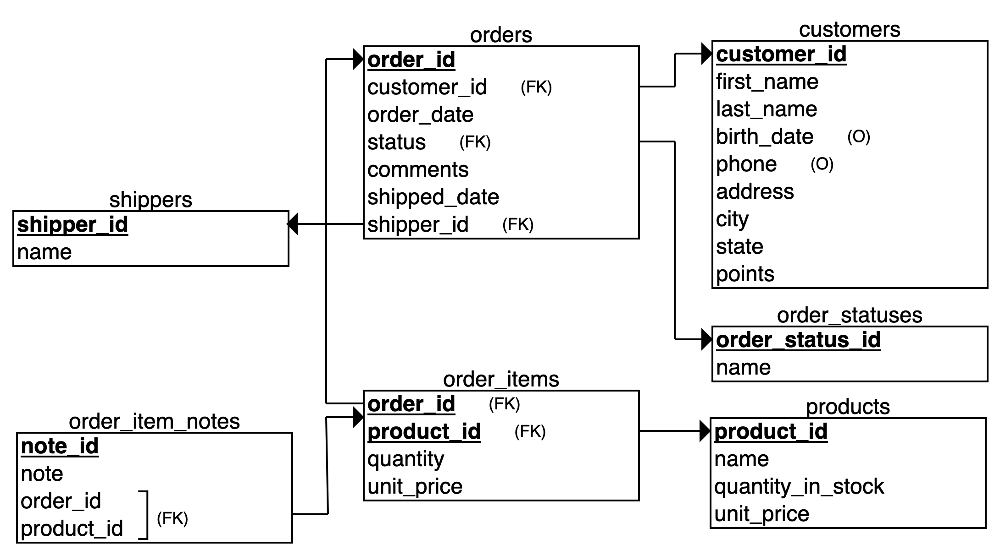
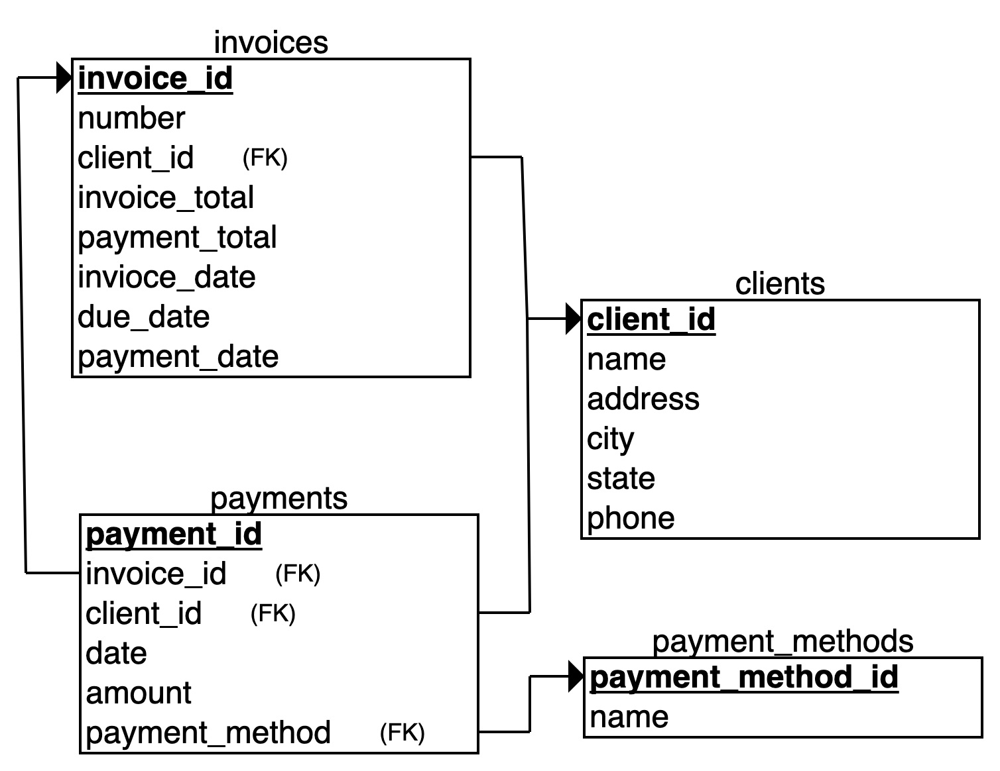
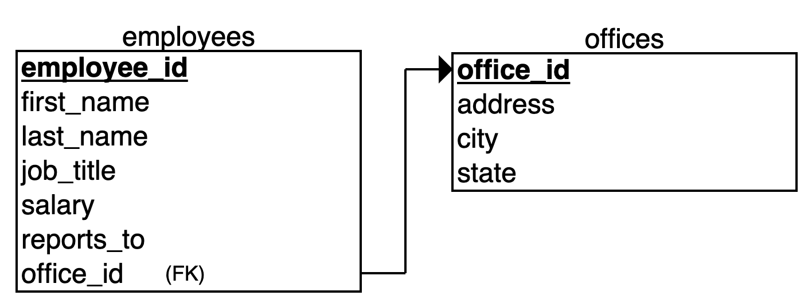

## mysql_mosh
Samples SQL databases provided by [Programming with Mosh](https://www.youtube.com/watch?v=7S_tz1z_5bA&ab_channel=ProgrammingwithMosh) for learning and practising sql.
```sql
USE `sql_store`;
SHOW tables;
DESCRIBE `orders`;
SELECT * FROM `orders`;
-- and more...
```
| No.  | Database | Tables |
| - | - | - |
| 1 | sql_store | [7] orders, order_items, order_item_notes, order_statuses, shippers, customers, products |
| 2 | sql_invoicing | [4] invoices, payments, clients, payment_methods |
| 3 | sql_hr | [3] employees, offices |

#### Relational Schema
I have created relational schemas for the 3 databases for a better understanding of the data and for easier data-querying.
**sql_store**

**sql_invoicing**

**sql_hr**

